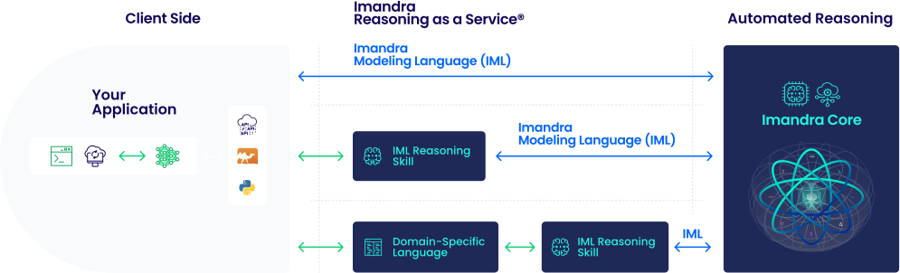

# Introduction

*This introduction is designed to give you a brief and high-level overview of Imandra and some sample use cases. If you'd prefer to start "from the beginning", take a look at [A Quick Tour of Imandra](A%20Quick%20Tour%20of%20Imandra.md).*

Imandra is a programming language and an automated reasoning engine which you can use to create models/programs and reason about them. Imandra uses OCaml as the input language - we've given its "pure" subset a mechanized formal semantics allowing Imandra to automatically translate the code into mathematical logic and analyze it using a variety of cutting-edge techniques. Imandra is very special in several important ways, here are just a few:

- It's built on many breakthroughs that eliminate manual work that was historically required (e.g. using academic tools). Traditionally, logical analysis of code for industrial applications required a PhD - with Imandra, you just write code and properties you wish to analyze, and Imandra does the work.
- It contains a myriad of techniques that are required for "real world" industrial applications of automated reasoning that would typically be implemented in disparate tools.
- It's cloud-native - to scale to "real-world" applications, we've had to do a lot of engineering which you can now access via APIs and integrate into your products.


The following pages contain further information on the technical details behind Imandra:

- [Imandra Core product page](https://www.imandra.ai/core "Imandra Core")
- [Imandra Vs. documentation page](https://docs.imandra.ai/imandra-docs/notebooks/imandravs/)

## What can you do with Imandra?

The short answer is "Quite a lot!" Our customers have used Imandra to verify complex algorithms, rigorously test and audit their complex software systems, develop new AI product offerings and much more. Imandra brings the most value where/when you rely on algorithms, which is pretty much almost everything these days.

Below, we've tried to create a few broad categories of use-cases with high-level explanations and links to demos and tutorials. As always, if you have specific questions - please do not hesitate to reach out to us ([contact@imandra.ai](mailto:contact@imandra.ai "Contact Imandra")).

### Create and reason about mental models

LLMs have fundmental flaws that stem from their statistical nature - hallucinations, lack of explainability and audit trail.

To fix this, Large Language Models (LLMs) can use Imandra to build mental models and reason about them, unlocking the incredible potential of generative AI for industries where correctness and compliance matter.

Check out this video for further details:

[](https://www.youtube.com/watch?v=e8uFEQ3alo4)

There are two (primary) ways to integrate Imandra with your LLMs:

1. "Raw" use of Imandra Core (we're working on a Python API interface to make this very easy to get up and running. Should be released soon!) where the LLM is trained to translate problems/questions into IML and query Imandra for answers.
2. Use of "Reasoning Skills" - these are special Imandra modules that are auto-generated from a reasoning skill model that you encode in Imandra. The generated code contains functions that make it very easy to build, inspect and reason about the model.

With option 1, you write more example data to teach your LLM how to translate problems into Imandra with minimal modifications on the Imandra side. Option 2 is the opposite - you create the IML scaffolding on the Imandra side with minimal data training for the LLM.



We also have another type of "Reasoning Skills" - with Domain Specific Languages ("DSLs"). This is a good option for really complex domains like reasoning about Financial Information eXchange ("FIX") specifications used to connect trading systems in finance. We work with corporations on creating new DSLs or domain-specific interfaces. For example, we're also working on SysML 2.0 modeling in Imandra. Please reach out to [contact@imandra.ai](mailto:contact@imandra.ai "Contact us") if you think this integration could be relevant in your domain.

## Discovering specifications

Another special feature of Imandra is "Discover" - it **generates** code from data that logically describes the obvservations. This has many important applications randing from ensuring third party applications are conforming with their interfaces to cyber security.

Here's a quick example where modules `A` and `B` represent different APIs:

```
#require "imandra-discover-bridge";;

open Imandra_discover_bridge.User_level;;

type at = int;;

type bt = string;;

module A = struct

  let rec f (x : at) : bt =
    if x < 0 then ""
    else if x = 0 then ""
    else "j" ^ (f (x - 1))

  let p (x : at) (y : at) : bt =
    f (x + y)

end;;

module B = struct

  let g (x : bt) : at = String.length x

  let h (x : bt) (y : bt) : bt = String.append x y

end;;

let funlist = ["A.f"; "A.p"; "B.g"; "B.h"];;

discover ~constructor_functions:false
         ~verify_bound:5i
         db
         funlist;;
```

This will produce:

```
 <===DISCOVER RESULTS===========================> 
These are the 11 conjectures suggested by Discover for discover_run.
fun x -> (B.g (A.f (B.g x))) = (B.g x) 
fun x -> (A.f (B.g (A.f x))) = (A.f x) 
fun x y -> (A.p y x) = (A.p x y) 
fun x y -> (A.f (B.g (A.p x y))) = (A.p x y) 
fun x -> (A.p x x) = (B.h (A.f x) (A.f x)) 
fun x y -> (B.g (B.h y x)) = (B.g (B.h x y)) 
fun x y -> (A.p (B.g x) (B.g y)) = (A.f (B.g (B.h x y))) 
fun x -> (A.p x (B.g (A.f x))) = (B.h (A.f x) (A.f x)) 
fun x y z -> (B.h (B.h x y) z) = (B.h x (B.h y z)) 
fun x y -> (B.h (A.f y) (A.f x)) = (B.h (A.f x) (A.f y)) 
fun x -> (A.f (B.g (B.h (A.f x) (A.f x)))) = (B.h (A.f x) (A.f x)) 
These are SUBSUMED laws that may be interesting to the user.
 No subsumed conjectures.
 <==============================================> 
```

Once we have these conjectures - we can translate them into code, natural language or perform other types of reasoning with Imandra.

Check out this [example to learn more](https://docs.imandra.ai/imandra-docs/notebooks/imandra-discover/ "Imandra Discover").

### Model-Based Software Development ("MBSD")

The concept of "digital twins" has become envogue right now, but we've applied this technique to model, test and audit complex software systems with great industrial success for a number of years. Moreover, with Imandra's formal methods features we provide the ultimate "shift left" methodology. Here is a typical workflow once you encode the requirements as an Imandra model:

1. Verify their compliance with requirements and regulations
2. Use them to rigorously test the implementations before release into production
3. Audit their performance post production release


### Apply formal methods to answer questions about programs (e.g. Neural Networks)

Formal verification seeks to apply local reasoning to answer deep questions about behavior of programs. In our case, programs written in IML. Use of formal methods (including verification) is present in most applications of Imandra, so quite a few of the demos in our gallery will have relevant information and tutorial.

[In this example](https://docs.imandra.ai/imandra-docs/notebooks/supervised-learning/ "Analyzing Machine Learnt models with Imandra"), we illustrate how to encode a model of a neural network:

```
let relu x = Real.(if x > 0.0 then x else 0.0);;

let linear x = Real.(x)

let layer_0 (x_0, x_1, x_2, x_3, x_4, x_5) = let open Real in
  let y_0 = relu @@ (0.20124)*x_0 + (-0.15722)*x_1 + (-0.19063)*x_2 + (-0.54562)*x_3 + (0.03425)*x_4 + (0.50104)*x_5 + -0.02768 in
  let y_1 = relu @@ (0.29103)*x_0 + (0.03180)*x_1 + (-0.16336)*x_2 + (0.17919)*x_3 + (0.32971)*x_4 + (-0.43206)*x_5 + -0.02620 in
  let y_2 = relu @@ (0.66419)*x_0 + (0.25399)*x_1 + (0.00449)*x_2 + (0.03841)*x_3 + (-0.51482)*x_4 + (0.58299)*x_5 + 0.11858 in
  let y_3 = relu @@ (0.47598)*x_0 + (-0.36142)*x_1 + (0.38981)*x_2 + (0.27632)*x_3 + (-0.61231)*x_4 + (-0.03662)*x_5 + -0.02890 in
  let y_4 = relu @@ (0.10277)*x_0 + (-0.28841)*x_1 + (0.04637)*x_2 + (0.28808)*x_3 + (0.05957)*x_4 + (-0.22041)*x_5 + 0.18270 in
  let y_5 = relu @@ (0.55604)*x_0 + (-0.04015)*x_1 + (0.10557)*x_2 + (0.60757)*x_3 + (-0.32314)*x_4 + (0.47933)*x_5 + -0.24876 in
  (y_0, y_1, y_2, y_3, y_4, y_5)

let layer_1 (x_0, x_1, x_2, x_3, x_4, x_5) = let open Real in
  let y_0 = linear @@ (0.28248)*x_0 + (-0.25208)*x_1 + (-0.50075)*x_2 + (-0.07092)*x_3 + (-0.43189)*x_4 + (0.60065)*x_5 + 0.47136 in
  (y_0)

let nn (x_0, x_1, x_2, x_3, x_4, x_5) = let open Real in
  (x_0, x_1, x_2, x_3, x_4, x_5) |> layer_0 |> layer_1
```

Once we have the model in Imandra, we can begin to ask deep questions about its behavior - note that these questions may involve *infinitely* many possible inputs!

```
instance (fun x -> nn_model x >. 20.0 && x.temp = 20.0 && x.month = May)

```

The response is:

```
- : nn_input -> bool = <fun>
module CX : sig val x : nn_input end
Instance (after 0 steps, 0.043s):
let x : nn_input =
  {month = May; day = Tue;
   dmc = 267882482533667911234131057007291/426061981977150606166133842500;
   temp = 20;
   rh = 1193233940814995401320511216110217/2999476353119140267409582251200;
   rain = 8525698623607481904124612650089/468668180174865666782747226750}

```

In other examples in our gallery and documentation pages on verification, you'll see examples where Imandra is asked to verify that properties hold true and if so, produce logical proofs.

## User interfaces

Imandra has a number of user interfaces:

- Jupyter notebooks
- VS Code Plug-in
- Command line interface
- (Coming soon!) Python APIs

[Check out the installation instructions.](https://docs.imandra.ai/imandra-docs/notebooks/installation/)

## How to get started

The best way to get started is by going through the tutorials and the demonstrations. A basic knowledge of OCaml is preferred - luckily there are quite a few tutorials online that teach OCaml and [the offical website offers great tutorials](https://ocaml.org/ "Ocaml.ord"). There's also the excellent "Real World OCaml" [available online for free](https://dev.realworldocaml.org/toc.html "Real World OCaml").
